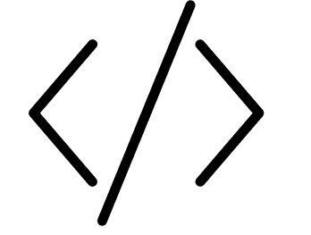
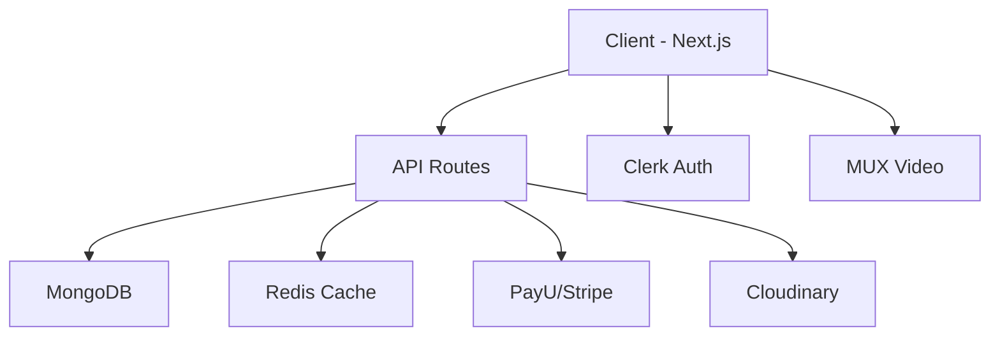

# 📚 EducationalHub.in

<div align="center">



**A modern, full-featured e-learning platform serving 10,000+ students worldwide**

[](https://nextjs.org/)
[](https://www.typescriptlang.org/)
[](https://clerk.dev/)
[](https://www.mongodb.com/)

[Live Demo](https://educationalhub.in) · [Report Bug](https://github.com/santhoshkumar-dev/educationalhub-frontend/issues) · [Request Feature](https://github.com/santhoshkumar-dev/educationalhub-frontend/issues)

</div>

---

## ✨ Features

- 🎥 **Video Streaming** - HLS video delivery with MUX integration
- 👤 **User Authentication** - Secure sign-in/sign-up with Clerk
- 💳 **Payments** - PayU and Stripe integration for course purchases
- 📊 **Progress Tracking** - Resume videos where you left off
- 🔖 **Notes & Bookmarks** - Take notes while watching courses
- 💬 **Comments & Discussions** - Community engagement on courses
- 🏢 **Organizations** - Support for institutions and organizations
- 📱 **Responsive Design** - Works on all devices

## 🛠️ Tech Stack

| Category      | Technology              |
| ------------- | ----------------------- |
| **Framework** | Next.js 14 (App Router) |
| **Language**  | TypeScript              |
| **Styling**   | Tailwind CSS            |
| **Auth**      | Clerk                   |
| **Database**  | MongoDB with Mongoose   |
| **Payments**  | PayU, Stripe, Razorpay  |
| **Video**     | MUX, HLS.js, Vidstack   |
| **Storage**   | Cloudinary, AWS S3      |
| **Caching**   | Redis                   |

## 🚀 Quick Start

### Prerequisites

- Node.js 18+
- npm or yarn
- MongoDB (local or Atlas)
- Redis (optional but recommended)

### Installation

1. **Clone the repository**

   ```bash
   git clone https://github.com/santhoshkumar-dev/educationalhub-frontend.git
   cd educationalhub-frontend
   ```

2. **Install dependencies**

   ```bash
   npm install
   ```

3. **Set up environment variables**

   ```bash
   cp .env.example .env.local
   ```

   Edit `.env.local` with your configuration (see [Environment Variables](#environment-variables))

4. **Run the development server**

   ```bash
   npm run dev
   ```

5. **Open your browser**
   Navigate to [http://localhost:3000](http://localhost:3000)

## ⚙️ Environment Variables

Copy `.env.example` to `.env.local` and configure the following:

| Variable                            | Description               | Required |
| ----------------------------------- | ------------------------- | -------- |
| `NEXT_PUBLIC_SITE_URL`              | Frontend URL              | ✅       |
| `NEXT_PUBLIC_SERVER_URL`            | Backend API URL           | ✅       |
| `MONGO_URL`                         | MongoDB connection string | ✅       |
| `NEXT_PUBLIC_CLERK_PUBLISHABLE_KEY` | Clerk public key          | ✅       |
| `CLERK_SECRET_KEY`                  | Clerk secret key          | ✅       |
| `PAYU_MERCHANT_KEY`                 | PayU merchant key         | ✅       |
| `MUX_TOKEN_ID`                      | MUX token ID              | ✅       |
| `NEXT_PUBLIC_CLOUDINARY_CLOUD_NAME` | Cloudinary cloud name     | ✅       |

See `.env.example` for the complete list.

## 📁 Project Structure

```
├── app/                    # Next.js App Router pages
│   ├── (clerk)/           # Authentication pages
│   ├── (courses)/         # Course viewing pages
│   ├── admin/             # Admin dashboard
│   └── api/               # API routes
├── components/            # React components
│   ├── google-ads/        # AdSense integration
│   ├── payment/           # Payment modals
│   ├── static/            # Header, Footer, etc.
│   └── videoplayer/       # Video player components
├── lib/                   # Utility libraries
│   ├── database/          # MongoDB connection
│   ├── hooks/             # Custom React hooks
│   └── utils/             # Helper functions
├── models/                # Mongoose schemas
└── public/                # Static assets
```

## 🏗️ Architecture



## 🤝 Contributing

We welcome contributions! Please see [CONTRIBUTING.md](CONTRIBUTING.md) for guidelines.

1. Fork the repository
2. Create your feature branch (`git checkout -b feature/amazing-feature`)
3. Commit your changes (`git commit -m 'Add amazing feature'`)
4. Push to the branch (`git push origin feature/amazing-feature`)
5. Open a Pull Request

## 📜 License

This project is licensed under the MIT License - see the [LICENSE](LICENSE) file for details.

## 🙏 Acknowledgments

- [Clerk](https://clerk.dev/) for amazing authentication
- [MUX](https://mux.com/) for video streaming
- [Vercel](https://vercel.com/) for hosting
- All our wonderful students and contributors!

---

<div align="center">

**Built with ❤️ by [Santhosh Kumar](https://github.com/santhoshkumar-dev)**

⭐ Star this repo if you find it helpful!

</div>
